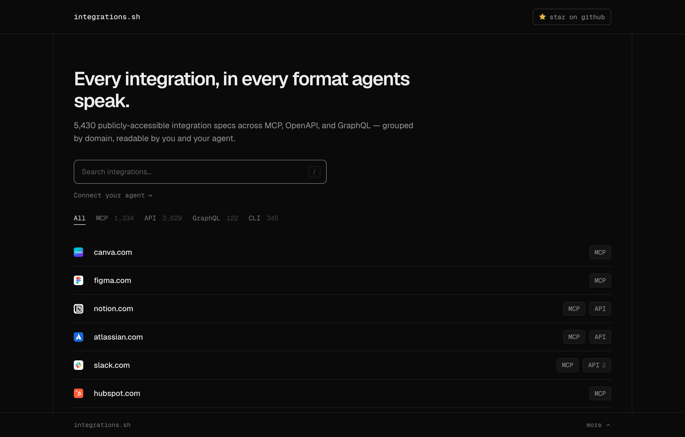
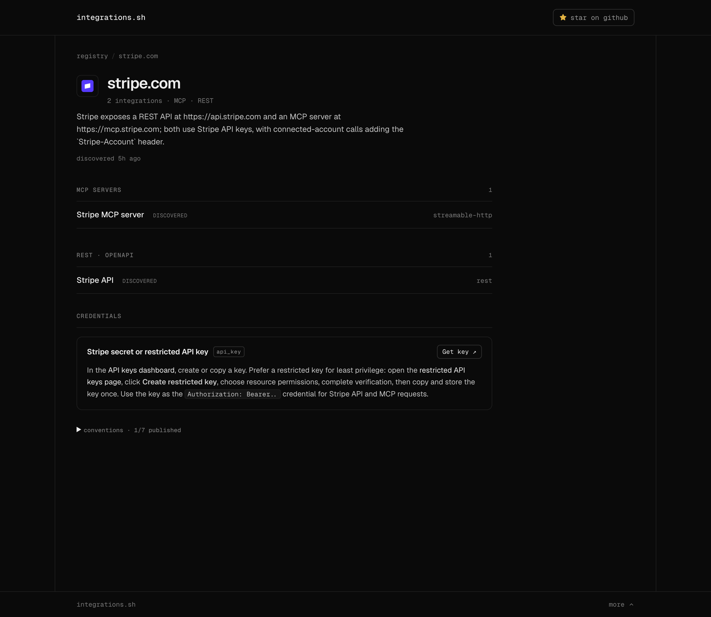
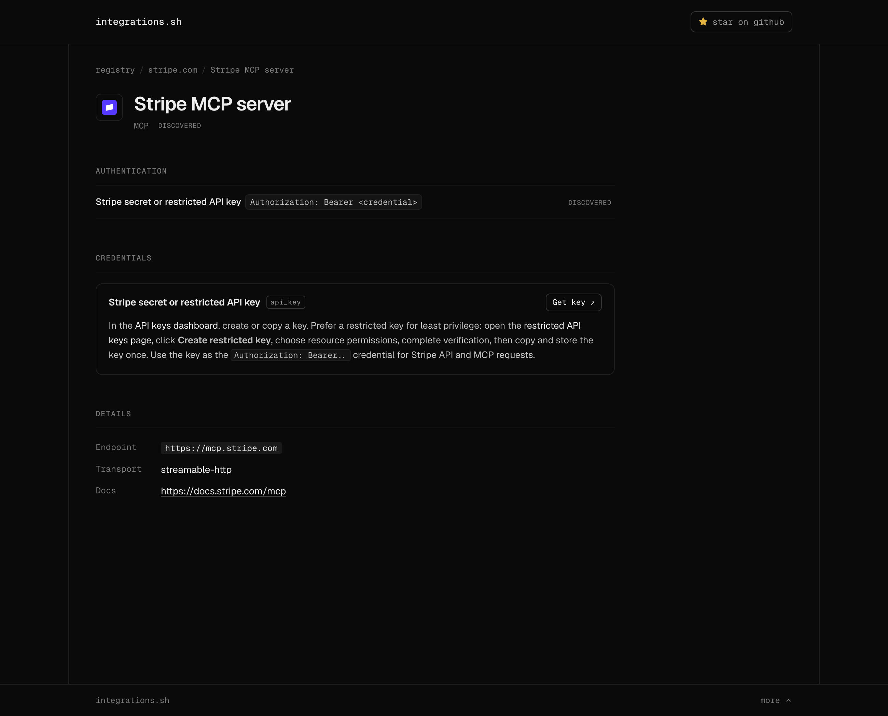

<div align="center">



<h1>integrations.sh</h1>

**Every integration, in every format agents speak.**

A registry of integration *surfaces* — MCP servers, REST/OpenAPI, GraphQL, and CLIs — for
thousands of services, each mapped to the credentials it needs and exactly how to get them.
Readable by you and your agent.

<p>
  <a href="https://integrations.sh"><b>integrations.sh</b></a> &nbsp;·&nbsp;
  <a href="#for-agents-api--mcp">API &amp; MCP</a> &nbsp;·&nbsp;
  <a href="#how-it-works">How it works</a> &nbsp;·&nbsp;
  <a href="#local-development">Develop</a>
</p>

<p>
  <a href="https://integrations.sh"></a>
  
  
  
  
  
  <a href="LICENSE"></a>
  <a href="https://github.com/UsefulSoftwareCo/integrations/stargazers"></a>
</p>

</div>

---

## What is this?

Agents are only as useful as what they can reach — and the services they need expose a
fragmented mess of interfaces: MCP servers, REST/OpenAPI, GraphQL, CLIs. That fragmentation
is fine. What's missing is the **map**: one place that says *"here is everything
`{service}` exposes, and here is exactly how to authenticate to each interface."*

**integrations.sh** is that map. Type a domain and get every publicly-reachable integration
surface for it, grouped by format, each annotated with:

- **where it lives** — endpoint, OpenAPI spec, transport, docs;
- **how you authenticate** — the credential you need, and the setup prose to acquire it;
- **how trustworthy the answer is** — every fact is tagged `detected` (re-verifiable from a
  machine signal the service publishes) or `discovered` (read from the service's docs).

The page you read and the JSON your agent fetches are the same content.

## Why auth is the bet

Discovery takes a minute; **auth takes an hour**. Finding out that Stripe has an MCP server is
easy — figuring out which key it wants, where to mint one with least privilege, and which
header to put it in is the part that actually costs you. So every surface leads with a
grounded, cited credential guide rather than a link dump.

---

## Explore a domain

Every domain page groups a service's surfaces by format (**MCP · REST/OpenAPI · GraphQL ·
CLI**), followed by the shared **credentials** those surfaces reference — defined once, bound
per-surface.

<div align="center">
  
</div>

Open any surface for the full picture — the exact **authentication** binding (which credential,
placed where), the **credential** and how to acquire it, and the raw **details** (endpoint,
transport, docs). Notice the `detected` / `discovered` badge on each: it's an honest signal of
how the fact was learned.

<div align="center">
  
</div>

---

## For agents (API + MCP)

integrations.sh dogfoods its own model: the site is itself a catalogued service, with a public
REST API **and** a public MCP server — no credentials required. Everything is machine-readable.

| Endpoint | What you get |
| --- | --- |
| `GET /api.json` | The whole catalog as one envelope — `{ version, generatedAt, data[] }`, one record per surface. |
| `GET /openapi.json` | OpenAPI 3.1 spec describing the REST API below. |
| `GET /api/{domain}/detect` | Probe a domain's well-known agent manifests (`llms.txt`, `api-catalog`, `mcp-server-card`, …). |
| `POST /api/{domain}/discover` | Map a domain's full surface + auth from scratch (LLM-backed; rate-limited). |
| `GET /api/{domain}/surface` | The structured surface document for a domain. |
| `/mcp` | MCP server exposing two tools: **`detect`** and **`discover`**. |
| `GET /.well-known/integrations.json` | The site's own agent card. |

```bash
# The whole registry, one fetch
curl https://integrations.sh/api.json

# What agent-readable manifests does stripe.com publish?
curl https://integrations.sh/api/stripe.com/detect

# Point any MCP client at the hosted server
#   url: https://integrations.sh/mcp   (tools: detect, discover)
```

---

## Project layout

```
integrations/
├─ src/
│  ├─ pages/            # routes — homepage, [domain], surface pages, api.json, /disc/*
│  ├─ components/       # Nav, DomainPage, Surfaces (the explorer island), …
│  ├─ layouts/          # Base.astro
│  └─ lib/              # catalog, discovery schema, detect, favicon, analytics …
├─ worker/              # entry.ts (routes), MCP Durable Object, REST API, registry
├─ scripts/             # normalize.ts, extract-tools.ts, validate-favicons.ts
├─ sources/             # upstream feeds (see Data sources)
├─ output/              # generated catalog (mostly gitignored) + tool/favicon caches
├─ docs/                # discovery-model.md, images
└─ wrangler.jsonc       # Cloudflare Worker config
```

---

## Local development

**Prerequisites:** [Bun](https://bun.sh).

```bash
bun install

# Dev server (runs `normalize` to build the catalog, then Astro on Node)
bun run dev            # → http://localhost:4321

# Production build (Astro + Cloudflare Worker output into dist/)
bun run build
bun run preview
```

`bun run dev` and `bun run build` both run **`normalize`** first, which regenerates
`output/*.json` from `sources/`. Those catalog files are gitignored — regenerate them, don't
edit them.

Live **discovery** and the hosted **MCP** are Worker features. To exercise them locally you need
`wrangler dev` and a couple of keys in `.dev.vars` (all optional — the flow degrades gracefully
if a key is absent):

| Var | Used for |
| --- | --- |
| `OPENAI_API_KEY` | the discovery LLM (discover is skipped without it) |
| `CONTEXT_DEV_API_KEY` | web-search grounding (falls back to a naive fetch) |
| `CONTEXT_DEV_LOGO_CLIENT_ID` | branding for the `/logo` proxy |

```bash
bun run cf:dev        # wrangler dev — Worker routes, KV, MCP
```

### Handy scripts

| Script | Does |
| --- | --- |
| `bun run normalize` | Aggregate `sources/` → `output/*.json` (the catalog). |
| `bun run extract-tools` | Extract per-integration tool lists → `output/tools/` (cached). |
| `bun run validate-favicons` | Validate icon URLs → `output/favicons.json` (cached). |

---

## Deploy

Hosted on Cloudflare Workers (worker `integrationsdotsh`, custom domains `integrations.sh` /
`www.integrations.sh`).

```bash
bun run cf:deploy       # build + wrangler deploy
bun run cf:deploy-only   # deploy an already-built dist/
```

Cloudflare Workers Builds (the repo's git integration) builds and deploys every push to `main`
automatically — the "Workers Builds: integrationsdotsh" check on each commit. The commands above
are for manual/emergency deploys only.

---

## Data sources

The catalog is aggregated from public feeds in `sources/`:

| File | Feed |
| --- | --- |
| `api-guru-openapi.json` | [APIs.guru](https://apis.guru) OpenAPI directory |
| `claude.json` | Anthropic / Claude MCP directory |
| `openai.json` | OpenAI MCP connector directory |
| `graphql.json` | Public GraphQL APIs |
| `cli.json` | CLI seed set |
| `openapi-manual.json` | Hand-curated OpenAPI additions & overrides |

Fix the **pipeline**, not the records: dedup rules, version-collapsing, and favicon fallbacks
all live in `normalize.ts`.

---

## Status & license

Early and moving fast (`v0.0.1`) — schema and routes may change.

[MIT](LICENSE) © Rhys Sullivan
